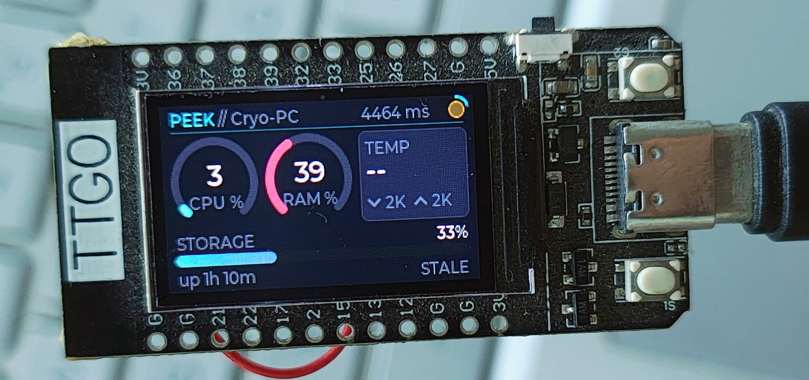
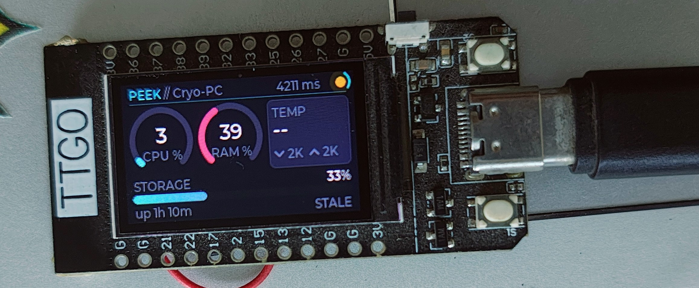
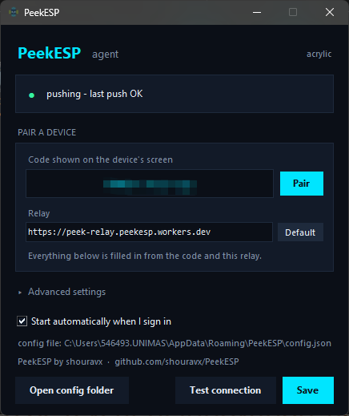
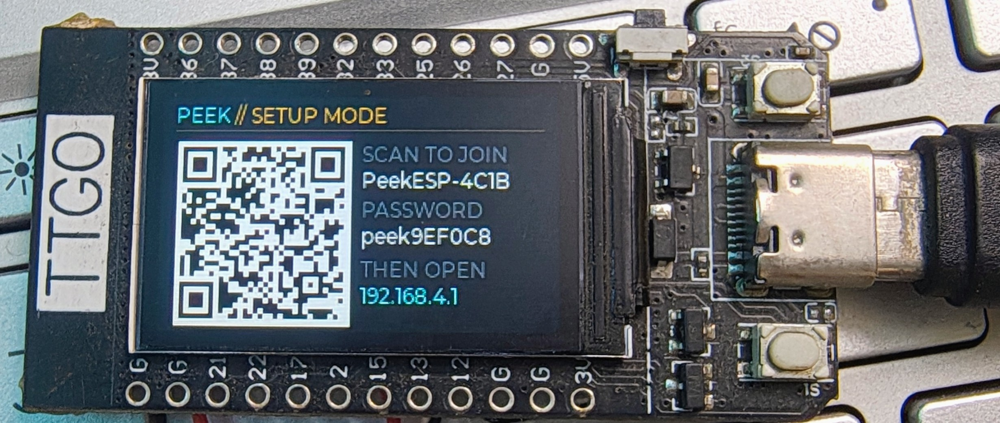

<div align="center">


# PeekESP

**A physical system-metrics dashboard for a remote Linux box.**




<sub>Live CPU, RAM, storage and throughput for a machine on the other side of the internet.</sub>

</div>

An ESP32 (LilyGO TTGO T-Display) monitors a remote Linux or Windows machine,
polling every few seconds and sweeping the readings into place with 500 ms eased
animations rather than snapping.

## Quick start

```bash
python quickstart.py
```

Builds the Windows app and flashes the board with the firmware committed in
[firmware/](firmware/). **No Arduino IDE, no ESP32 core, no libraries, no
toolchain** — the only download is esptool, about 3 MB. Then:

1. The device shows a pairing code, like **`K7M2-P4QX-9R`**
2. Run `windows/dist/PeekESP.exe` → tray icon → **Settings**
3. Type the code into **Pair a device** → **Pair** → **Save**

That is the whole setup. **No account, no token, no port forward, no VPN** — the
device and the app derive everything else from the code, and the relay never
sees it.

Only planning to *change* the firmware? `python quickstart.py --dev` installs the
Arduino toolchain and builds from source instead.



Two arcs for CPU and RAM, a panel for temperature and throughput, a storage bar
with the free space beside it, and a status line that names what the link is
doing rather than leaving you to guess.

## What's in here

| Path | What it is |
|---|---|
| [PeekESP/PeekESP.ino](PeekESP/PeekESP.ino) | The firmware. Open this one in the Arduino IDE. |
| [PeekESP/secrets.example.h](PeekESP/secrets.example.h) | Optional factory defaults. Real config happens on-device. |
| [lv_conf.h](lv_conf.h) | LVGL config for this board. |
| [platformio.ini](platformio.ini) + [main.cpp](main.cpp) | PlatformIO build of the exact same sketch. |
| [dietpi/peek-agent.py](dietpi/peek-agent.py) | Run on the Linux host: serves the JSON, and/or pushes it to the relay. |
| [windows/](windows/) | The same agent for a Windows PC, plus a one-file `.exe` build. |
| [cloudflare/](cloudflare/) | Worker relay for when the host has no reachable port. `npm test` covers it. |
| [.github/workflows/](.github/workflows/) | CI: tests the Worker, deploys it on merge, pings it weekly. |
| [tools/png_to_lvgl.py](tools/png_to_lvgl.py) | Turns a PNG into the compiled-in boot logo. |
| [tools/make_icon.py](tools/make_icon.py) | Builds the multi-resolution Windows `.ico` from the logo. |
| [quickstart.py](quickstart.py) | Install, build and flash in one command. |
| [tools/setup_arduino.py](tools/setup_arduino.py) | Installs the core and every library, patched and pinned. |
| [firmware/](firmware/) | The compiled firmware, ready to flash. No toolchain needed. |
| [tools/flash.py](tools/flash.py) | Flashes it and opens the serial monitor. No IDE. |
| [tools/export_firmware.py](tools/export_firmware.py) | Rebuilds that image after a firmware change. |

## Architecture

Two pinned FreeRTOS tasks that share nothing but a mutex-guarded struct:

- **Core 0** — WiFi → NTP → a blocking `HTTPS GET` → JSON parse. Everything here
  is allowed to stall for seconds at a time. It also samples the battery ADC,
  filters it and works out the charge state, in the gaps between polls where it
  would otherwise just be asleep.
- **Core 1** — `lv_timer_handler()` and nothing else. It never opens a socket
  and never waits on hardware, so a slow link cannot drop a frame. It picks up
  new data by watching a sequence counter and takes the mutex with a zero
  timeout, so even a contended lock just defers the update to the next tick
  rather than blocking the UI.

The battery split matters more than it looks. Sixteen `analogRead` calls is a
millisecond or two of blocking, and it used to run *inside* the LVGL timer —
the one place on this device that must never block, because a frame missed
there is a visible stutter mid-animation. Core 0 publishes four values; core 1
formats them and draws.

Core 1 also sleeps for however long `lv_timer_handler()` says the next timer is
due, clamped to 2–30 ms, rather than a flat 5 ms. During an animation that is
about as often as before; with nothing moving it is a handful of wakeups a
second instead of two hundred.

Values animate through `lv_anim_t` with `lv_anim_path_ease_out` over 500 ms. The
gauges run on a 0–1000 range rather than 0–100 so a 3 % change still resolves
into ~30 distinct steps and reads as a sweep, not a staircase.

## Why a relay

The hard part of this project isn't the display — it's that **something has to
accept an inbound connection**, and the ESP32 can only dial out.

A plain WireGuard tunnel solves that, and this project used to do it, but the
tunnel has to terminate on the monitored host. Behind CGNAT, or on a network you
don't administer, that option doesn't exist. Pushing through a Cloudflare Worker
instead means **both ends only ever dial out**, which works everywhere the
tunnel did and everywhere it didn't.

An ESP32 also can't join a Tailscale network, which is the other thing people
reach for: Tailscale is WireGuard plus a control plane — node registration,
rotating keys, NAT traversal, DERP relays — and none of that has an embedded
client.

The relay has three modes, all on one deployment:

| | **Paired** | **Private** | **Shared** |
|---|---|---|---|
| Setup | type the device's code | two Worker secrets | one `MASTER_SECRET` |
| Worker config | **none** | `PUSH_TOKEN` + `READ_TOKEN` | mint per stream |
| For | just working | only you | you and other people |

## Get it

| | |
|---|---|
| **This repository** | [Download ZIP](https://github.com/shouravx/PeekESP/archive/refs/heads/main.zip) &middot; `git clone https://github.com/shouravx/PeekESP.git` |
| **Windows app** | build it: `cd windows && python build.py` &rarr; `dist/PeekESP.exe` |
| **Arduino IDE** | [arduino.cc/en/software](https://www.arduino.cc/en/software) |
| **Python 3** | [python.org/downloads](https://www.python.org/downloads/) — needed only for the setup scripts and the agent |

**Nothing else to download.** The compiled firmware is committed at
`firmware/PeekESP-merged.bin` (1.25 MB), so flashing needs no core, no libraries
and no toolchain — `tools/flash.py` fetches only esptool, ~3 MB.

```bash
python tools/flash.py              # flash the committed image, then watch serial
python tools/flash.py --erase      # also wipe settings, for a fresh pairing code
```

To modify the firmware you do need the toolchain, and one command installs all
of it at the pinned versions, patched:

```bash
python tools/setup_arduino.py      # ~250 MB, once
python tools/export_firmware.py    # rebuild the committed image after a change
```

`setup_arduino.py --check` reports what is installed without changing anything.
Everything lands in the normal Arduino folders, so the Arduino IDE sees it too
if you prefer to work there.

<details>
<summary>If you would rather install them by hand</summary>

| | Version | Where |
|---|---|---|
| ESP32 core | **2.0.17** | Boards Manager, or [package_esp32_index.json](https://espressif.github.io/arduino-esp32/package_esp32_index.json) |
| lvgl | **8.3.9** — not 9.x | [github.com/lvgl/lvgl](https://github.com/lvgl/lvgl/releases/tag/v8.3.9) |
| TFT_eSPI | 2.5.43 | [github.com/Bodmer/TFT_eSPI](https://github.com/Bodmer/TFT_eSPI) |
| ArduinoJson | 7.4.3 | [arduinojson.org](https://arduinojson.org/) |

Then two edits the script would have done for you: in
`<Arduino>/libraries/TFT_eSPI/User_Setup_Select.h` comment out
`#include <User_Setup.h>` and uncomment the `Setup25_TTGO_T_Display.h` line, and
copy this repo's `lv_conf.h` to `<Arduino>/libraries/lv_conf.h` — *beside* the
`lvgl` folder, not inside it.

The libraries are not committed to this repository because LVGL alone is 97 MB
across 1160 files and TFT_eSPI another 34 MB; and LVGL finds `lv_conf.h` by
looking one directory *above* its own folder, which cannot work from inside a
sketch without build flags the Arduino IDE has no way to set.

</details>

## Setup

### 1. On the host — the telemetry agent

**Linux / DietPi — one line.** Flash the device first so it has a code to show
you, then:

```bash
curl -fsSL https://raw.githubusercontent.com/shouravx/PeekESP/main/dietpi/install.sh | sudo sh
```

It asks for the pairing code and derives everything else — relay URL, stream,
push token — locally. Then it installs a hardened systemd service, starts it,
and waits to confirm the machine is actually pushing before it says it worked.

Afterwards everything is managed with the `peekesp` command it installs —
`peekesp status`, `peekesp logs -f`, `peekesp test`, `sudo peekesp pair CODE`,
`sudo peekesp set interval 15`, `sudo peekesp uninstall`. Full detail in
[dietpi/](dietpi/).

To skip the prompt, or to run it from a script:

```bash
curl -fsSL https://raw.githubusercontent.com/shouravx/PeekESP/main/dietpi/install.sh | sudo sh -s -- K7M2-P4QX-9R
```

Piping a script from the internet into a root shell means trusting whatever is
at that URL. Read it first if you would rather — that is the honest advice, not
a formality:

```bash
curl -fsSLO https://raw.githubusercontent.com/shouravx/PeekESP/main/dietpi/install.sh
less install.sh && sudo sh install.sh
```

**Windows** — same JSON, same fields, standard library only. See
[windows/](windows/). Once the [winget submission](packaging/winget/README.md)
lands:

```powershell
winget install shouravx.PeekESP
```

Until then, grab the zip from [Releases](https://github.com/shouravx/PeekESP/releases),
or run it from source:

```bash
python windows\peek_agent_win.py --once
```

Check it reads your machine correctly before wiring anything up — run it in the
foreground and, from another shell:

```bash
curl http://localhost:8080/telemetry
```

You should get real numbers.

### 2. Deploy the relay

```bash
cd cloudflare
npm install -g wrangler && wrangler login
npx wrangler deploy
```

That is the whole deployment. **Pairing needs no secrets on the Worker at all** —
the device and the app derive their stream and tokens from the pairing code
locally, and the Worker never sees it. `/health` reporting
`"configured": false` is the expected state.

`PUSH_TOKEN` / `READ_TOKEN` (private) and `MASTER_SECRET` (named streams) are
only for the other two modes — see [cloudflare/](cloudflare/).

Deploys can run themselves: add a `CLOUDFLARE_API_TOKEN` secret and the
[workflow](.github/workflows/cloudflare-worker.yml) tests every change to
`cloudflare/**`, deploys on merge to `main`, and health-checks weekly.

> Free-tier note: this uses a **Durable Object**, not Workers KV. KV's free tier
> allows 1,000 writes/day and a 5-second push interval is 17,280 — it would fail
> partway through day one.
>
> Requests are what you actually budget. At a 5-second interval each agent costs
> 17,280 pushes/day and each display costs 17,280 polls/day, against a 100k/day
> allowance. So **one display plus two machines fits; one display plus four does
> not.** A display polls once no matter how many machines it shows — the cost is
> per *agent*, not per screen you swipe to. Raising the interval to 15 s divides
> everything by three.

### 3. Pair the device

Flash the sketch, and the ESP32 shows a code like **`K7M2-P4QX-9R`**. Open the
Windows app, right-click the tray icon → **Settings**, type the code into
**Pair a device**, press **Pair** then **Save**.



Everything below the code is filled in from it. The status line at the top says
what the agent is actually doing, so "did it work" is answered on the same
screen where you typed the code.

That is the entire configuration. The relay URL, the stream and both tokens are
derived from the code on both sides; dashes and case are ignored. The device
stops showing the code as soon as the first reading arrives.

On Linux the one-liner in step 1 already took the code and installed the
service, so there is nothing to do here. On Windows the tray app's **Start
automatically when I sign in** does the same with no service to install.

**Run the same command on every machine you want to watch, with the same code.**
A pairing code identifies you, not a machine: a Windows box, a Mac and a DietPi
sharing one code all appear on the display, and the left button swipes between
them. Six per code.

### 4. Flashing the ESP32

```bash
python tools/flash.py
```

Finds the board, writes `firmware/PeekESP-merged.bin`, and opens the serial
monitor so you can read the pairing code as it boots. `--erase` wipes saved
settings, which is how you get a *new* pairing code — re-flashing alone keeps
the old one, because it lives in NVS and survives a firmware update.

`--build` compiles from source instead, if you have the toolchain.

Prefer the Arduino IDE? Everything is already installed and patched: open
`PeekESP/PeekESP.ino`, set **Board: LilyGo T-Display** and **Tools → Partition
Scheme → Huge APP**, upload. *ESP32 Dev Module* also works; both are verified.

**Verified build** — ESP32 core 2.0.17, lvgl 8.3.9, ArduinoJson 7.4.3,
against **both** TFT_eSPI builds:

| TFT_eSPI | Flash | Result |
|---|---|---|
| LilyGO 2.2.20 (preconfigured) | 1,234,601 B | clean, no warnings |
| Library Manager 2.5.43 | 1,238,797 B | clean, no warnings |

The sketch only uses `init` / `setRotation` / `fillScreen` / `startWrite` /
`setAddrWindow` / `pushColors` / `endWrite`, all stable across that version gap.

```
Sketch uses 1234601 bytes (39%) of program storage space.
Global variables use 119748 bytes (36%) of dynamic memory.
```

That 39 % is with **Huge APP**. On the default 1.2 MB partition it's **94 %** —
it still fits, but there's nothing left, so set *Tools → Partition Scheme →
Huge APP (3MB No OTA/1MB SPIFFS)*.

### 4b. Flashing the ESP32 — PlatformIO

Steps 3 and 5 are unnecessary; `platformio.ini` supplies the TFT_eSPI pinout and
the LVGL config path as build flags, which is why PlatformIO never had the
`User_Setup_Select.h` problem in the first place. Then:

```bash
pio run -t upload -t monitor
```

## Configuration

There is no compile-time setup. A freshly flashed device has no WiFi
credentials, so it boots straight into **setup mode**: it raises its own access
point and the screen shows a QR code.



1. Scan the QR with a phone camera — it encodes a `WIFI:` join string, so the
   phone joins the AP directly. No typing the generated password off a 1.14"
   panel.
2. The captive portal opens the form (or browse to `192.168.4.1`).
3. Pick your WiFi from the dropdown — the device scans and lists what it can
   see, strongest first, with a `*` on the ones needing a password. **Scan
   again** re-runs it, and *Other / hidden network* lets you type a name the
   scan cannot see. Everything else is already filled in.
4. **Save & Reboot** — settings go to NVS and survive reflashing the sketch.

To change something later, hold the **left button for 1.5 s**; the device
reboots into setup mode. Holding it during power-on does the same, which is the
way back in if you typo the WiFi password. "Erase all settings" at the bottom of
the form returns the device to factory defaults.

> The portal serves plain HTTP over its own WPA2 link — your WiFi passphrase
> crosses that link unencrypted. TLS would need a certificate no phone would
> trust, and the alternative is entering a 48-character token with two
> buttons. The AP is only up while you are configuring it, and its password is
> derived per-device from the MAC.

## Changing the boot logo

The device shows the logo for about a second at boot, then fades it out while
the network is already connecting underneath — the splash costs no boot time,
it just covers the moment the dashboard would otherwise show a screen of zeroes.

`PeekESP/logo_splash.h` is generated, not hand-written. To use different
artwork:

```bash
python tools/png_to_lvgl.py img/logo.png PeekESP/logo_splash.h --name logo_splash --size 96 --bg 05070E
```

It composites transparency onto the theme background (`--bg`), scales to fit
`--size`, and emits RGB565 in the byte order the firmware's `LV_COLOR_16_SWAP`
setting expects. At 96×96 that is 18 KB of **flash** — the image is `const`, so
it costs no RAM at all.

Alpha is flattened rather than kept: `LV_IMG_CF_TRUE_COLOR_ALPHA` would be 3
bytes per pixel and blend every frame, and the splash only ever sits on one
colour. Pass `--swap` if you ever set `LV_COLOR_16_SWAP` to 1 — the symptom of
getting it wrong is swapped red and blue, not an error.

## Buttons

Both buttons do two things, chosen by how long you hold them.

| Button | Action |
|---|---|
| Left (GPIO 0) — tap | Next page — each machine in turn, then the clock, then the power screen, then back to the first |
| Left — hold 1.5 s | Reboot into setup mode |
| Left — held at power-on | Boot straight into setup mode |
| Right (GPIO 35) — tap | Cycle backlight brightness — 100 / 59 / 27 / 8 %, remembered across reboots |
| Right — hold 1.2 s | Standby — panel off and polling paused |
| Right — press while in standby | Wake, back to the page you left |

Swiping costs nothing: one poll already carried every machine and the power
page is local, so the device makes the same number of requests whether you look
at one screen or at seven.

> **Standby, not deep sleep.** Deep sleep on an ESP32 ends in a *reset*: the
> chip comes back through `setup()`, rejoins WiFi, re-syncs NTP and lands on
> the first page — so "wake" meant "reboot and lose your place". Standby keeps
> RAM, the WiFi association and the page you were on, and wakes instantly.
>
> The cost is real and worth stating: standby draws milliamps where deep sleep
> draws microamps. But the backlight dominates this board's consumption by a
> wide margin, and turning that off plus pausing the polling is most of the
> saving. For a mains-powered desk gadget that is the right trade; for a month
> on a battery it would not be.
>
> (The earlier deep-sleep implementation also could not be woken at all, because
> GPIO 0 is a strapping pin — held low across the reset that ends deep sleep,
> the ESP32 latches it and comes up in the serial bootloader instead of running
> the sketch.)

## Clock

Dhaka time (UTC+6, no daylight saving), swiped to like any other page: a
12-hour clock with seconds, an AM/PM marker, the weekday and the full date, and
a bar that fills across the minute so the page never looks frozen. It lives in
[`PeekESP/clock_faces.h`](PeekESP/clock_faces.h) so the face can be redesigned
without reading past a thousand lines of networking.

There was briefly a second, time-only face. It went because it earned a whole
page of the carousel to show strictly less than the page beside it, and every
extra page is another button press between you and the machine you actually
wanted to look at.

The time comes from the NTP sync the TLS handshake needed anyway. The board has
no battery-backed RTC — the internal one keeps counting between syncs but
drifts, and loses everything on a power cut — so it shows `--:--` until the
first sync lands, rather than 01:00 on 1 January 1970, which is what an unsynced
ESP32 sincerely believes.

## Power screen

The last page of the swipe carousel. Tap the left button past the last machine
and you land on it: the board's own charge level and voltage, whether something
is holding it up, and — on the line below — the battery of whichever machine you
were just looking at.

It does not appear on its own. An earlier version raised it whenever the charge
state changed, which on a board whose voltage sits near the threshold meant it
reappeared every couple of seconds over the top of whatever you were reading.
The state now needs to climb past 4.32 V to count as charging and fall below
4.20 V to stop, so a reading that wobbles inside that band changes nothing.

Two different batteries are on this page. The big one is the **ESP32's own**
cell on the JST connector, read through a 1:2 divider on GPIO 34 behind a MOSFET
gated by GPIO 14 — worth knowing, because leaving that pin low reads a floating
node, which looks like a flat battery rather than like a measurement that never
happened. The line underneath is the **monitored machine's** battery, which the
agent reports; a desktop says `no battery` there rather than showing an empty
one.

**What it can and cannot tell you.** The T-Display exposes no charge-status
pin, so the state is inferred from voltage. A Li-ion cell off charge never sits
above 4.2 V, so anything holding the node above **4.32 V** is a charger. The
honest limit: a cell being topped up at 3.9 V reads exactly like one
discharging at 3.9 V. `CHARGING` here means *something external is holding this
up*, not *current is flowing into the cell*.

The percentage interpolates a Li-ion discharge curve rather than drawing a
straight line from 3.0 to 4.2 V — a linear reading spends most of the cell's
life saying "60 %" and then falls off a cliff. Voltage is shown alongside it,
so if your board reads differently, `VOLTS_CHARGING` in the sketch is the one
number to move.

## Telemetry contract

`GET http://<host>:8080/telemetry` → `200 application/json`

```json
{
  "host": "dietpi",
  "cpu_percent": 12.5,
  "ram_percent": 43.2,
  "storage_percent": 61.0,
  "storage_total_gb": 117.9,
  "storage_free_gb": 46.0,
  "cpu_temp_c": 48.3,
  "battery_percent": 78,
  "battery_charging": true,
  "battery_ac": true,
  "battery_minutes": 134,
  "uptime_seconds": 271830,
  "net_rx_kbps": 128.4,
  "net_tx_kbps": 12.9
}
```

Every field is optional on the wire — a missing key falls back to a default
rather than failing the parse. `cpu_temp_c` below zero renders as `--`, which is
what hosts with no thermal zone report.

### Several machines, one code

A pairing code identifies *you*, not a machine. Run the agent on a Windows box,
a Mac and a DietPi with the same code and all three appear on the display; the
buttons swipe between them. Nothing extra to configure — each agent already
reports its `host`, and the relay keeps a slot per host instead of letting them
overwrite each other.

The relay's reply carries them all, so the device gets everything in one poll:

```json
{
  "host": "windows-pc", "cpu_percent": 3.4, "age_s": 1,
  "device_count": 3,
  "devices": [
    { "host": "dietpi",     "cpu_percent": 12.5, "age_s": 3 },
    { "host": "macbook",    "cpu_percent": 8.1,  "age_s": 2 },
    { "host": "windows-pc", "cpu_percent": 3.4,  "age_s": 1 }
  ]
}
```

The freshest machine is repeated at the top level so a device flashed before
this existed keeps working untouched. `devices` is sorted by name rather than by
recency — the display swipes through this array, and an order that reshuffled
whenever a push landed would move a machine out from under your thumb.

Six machines per code. A host silent for 24 hours drops off the list; anything
still listed carries its own `age_s`, so the display can say how stale it is
rather than pretending it is live.

Storage covers **every fixed disk**, not just the system one: a machine with a
full 240 GB SSD and an empty 2 TB drive is mostly empty, and reporting only the
first would say the opposite. The two `_gb` fields arrived after 1.0.0; an agent
that predates them omits both, and the device shows the percentage alone rather
than `0 GB free`, which would read as a full disk instead of a missing field.

Windows counts each `DRIVE_FIXED` volume, so removable, optical and network
drives are excluded. Linux counts each filesystem backed by a block device,
deduplicated so a bind mount is not billed twice, and follows `df` — capacity is
what a normal user can occupy, with root's reserved 5 % excluded from both the
total and the free figure.

`battery_percent` is `-1` on a machine with no battery, which the display shows
as `no battery` rather than as a flat cell. `battery_charging` is the charging
flag itself, not "plugged in": a laptop sitting on mains at 100 % reports
`battery_ac: true, battery_charging: false`, because calling that *charging* is
how a battery readout stops being believed. `battery_minutes` is `-1` whenever
the OS declines to estimate, which it often does for the first minutes after a
cable is moved.

## Troubleshooting

| Symptom | Cause |
|---|---|
| Display works, `NO LINK` forever | The agent isn't pushing, or the device is polling a different stream. Check `[pair] code X -> stream Y` on serial matches what the app shows. |
| Image offset ~40 px, or garbled colours | Wrong TFT_eSPI setup selected. Step 4 above. |
| Boots, then reboots every ~60 s | Twelve failed polls in a row triggers the deliberate `esp_restart()`. The underlying failure is on the network side — watch the serial log at 115200. |
| Screen says `cannot join <name>` | Wrong password or the network is out of range. The device reopens its setup portal by itself after two attempts — rejoin `PeekESP-XXXX` and fix it. |
| Screen says `joining <name>...` and stays | It is retrying a network that has worked before, so it will not drop to setup. Hold the left button for 1.5 s to reconfigure. |
| Reboot loop, `task_wdt: IDLE0 (CPU 0)` | Core 0 blocked longer than the 5 s idle watchdog. `disableCore0WDT()` in `setup()` is what stops this; if you removed it, put it back. |
| Board runs warm | Normal to a point: the AMS1117 regulator burns `(5.0 − 3.3) × current` as heat. Modem sleep is on and the backlight cycles with the right button. |
| Backlight on, screen black | LVGL found no `lv_conf.h`. Step 5 — it belongs *beside* the `lvgl` folder. |
| Always boots to the QR setup screen | No SSID saved yet, or the left button is reading LOW at power-on (stuck button / something pulling GPIO 0 down). |
| Typo'd the WiFi password | Hold the left button while powering on to force setup mode back up. |
| `undefined reference to lv_qrcode_create` | Stock `lv_conf.h`. `LV_USE_QRCODE` and `LV_USE_SPINNER` default to 0 — use this repo's copy. |
| `region 'dram0_0_seg' overflowed` | LVGL's heap is a static array counted against a ~160 KB segment. Lower `LV_MEM_SIZE` in `lv_conf.h` (48 KB here) or shrink the draw buffer in the sketch. |
| `'Gauge' was not declared in this scope` | You added a function above the type it uses. The Arduino IDE injects generated prototypes before the *first* function definition, so every type used in a signature must be declared above that point. See the note on `struct Gauge`. |

## License

MIT — see [LICENSE](LICENSE).
