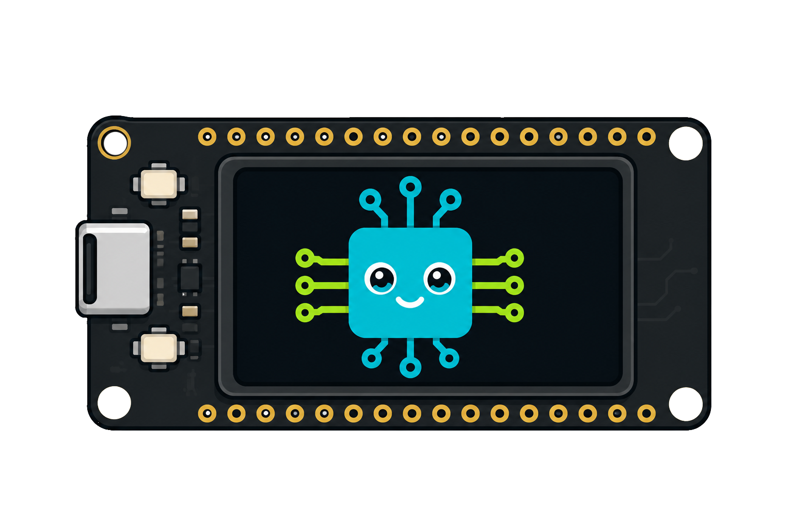

<div align="center">



# PeekESP

**A physical system-metrics dashboard for a remote Linux box.**


</div>

An ESP32 (LilyGO TTGO T-Display) reaches a remote DietPi box over an encrypted
WireGuard tunnel, polls it every 5 seconds, and sweeps the readings into place
with 500 ms eased animations instead of snapping. Two pinned FreeRTOS tasks keep
the network off the render thread, so a slow tunnel never costs a frame.

```
┌──────────────────────────────────────────────┐
│ PEEK  // dietpi                42 ms      ◍  │
│──────────────────────────────────────────────│
│    ╭────╮      ╭────╮      ┌──────────────┐  │
│    │ 12 │      │ 43 │      │ TEMP         │  │
│    │CPU%│      │RAM%│      │ 48°          │  │
│    ╰────╯      ╰────╯      │ ↓128K  ↑13K  │  │
│                            └──────────────┘  │
│ STORAGE                                 61%  │
│ ████████████████████░░░░░░░░░░░░░░░░░░░░░░░  │
│ up 3d 4h                            LINK OK  │
└──────────────────────────────────────────────┘
```

## What's in here

| Path | What it is |
|---|---|
| [PeekESP/PeekESP.ino](PeekESP/PeekESP.ino) | The firmware. Open this one in the Arduino IDE. |
| [PeekESP/secrets.example.h](PeekESP/secrets.example.h) | Optional factory defaults. Real config happens on-device. |
| [lv_conf.h](lv_conf.h) | LVGL config for this board. |
| [platformio.ini](platformio.ini) + [main.cpp](main.cpp) | PlatformIO build of the exact same sketch. |
| [dietpi-wireguard-setup.sh](dietpi-wireguard-setup.sh) | Run on the DietPi: creates the tunnel, prints the keys. |
| [dietpi/peek-agent.py](dietpi/peek-agent.py) | Run on the DietPi: serves the JSON the ESP32 reads. |

## Architecture

Two pinned FreeRTOS tasks that share nothing but a mutex-guarded struct:

- **Core 0** — WiFi → NTP → WireGuard handshake → blocking `HTTP GET` → JSON parse.
  Everything here is allowed to stall for seconds at a time.
- **Core 1** — `lv_timer_handler()` and nothing else. It never opens a socket, so
  a slow tunnel cannot drop a frame. It picks up new data by watching a sequence
  counter and takes the mutex with a zero timeout, so even a contended lock just
  defers the update to the next 120 ms tick rather than blocking the UI.

Values animate through `lv_anim_t` with `lv_anim_path_ease_out` over 500 ms. The
gauges run on a 0–1000 range rather than 0–100 so a 3 % change still resolves
into ~30 distinct steps and reads as a sweep, not a staircase.

## The Tailscale part, honestly

**An ESP32 cannot join a tailnet directly** — this is not a preference, and the
gap is not small:

| What Tailscale needs | Why the ESP32 can't |
|---|---|
| A control-plane client | `tailscaled` is Go. No implementation in C/C++, no Go runtime for Xtensa. |
| Node registration + key rotation | Keys are issued and **rotated** by the coordination server over an authenticated Noise channel. A static config pulled out of a tailnet goes stale on its own. |
| DERP relay fallback | When direct UDP fails, traffic falls back to HTTPS relays — a second full transport. |
| Disco / NAT traversal | Continuous peer discovery and endpoint negotiation. |

Tailscale *is* WireGuard for the data plane; everything above is the control
plane, and that's the part with no embedded client. Headscale doesn't help —
it reimplements the *server*, so you'd still need a client speaking the protocol.

What this project does instead: the DietPi runs a **plain WireGuard listener
(`wg0`) alongside its existing `tailscale0` interface**, and the ESP32 dials that.
Because the address the ESP32 asks for — the DietPi's own `100.x.x.x` — lives on
that same machine, the kernel answers it regardless of which interface the packet
arrived on. No forwarding rules, no NAT, no route advertisement needed.

`dietpi-wireguard-setup.sh` sets all of this up and prints the keys to paste into
the device's setup portal.

### How the ESP32 actually reaches the tailnet

```
ESP32 ──WiFi──▶ your router ──Internet──▶ DietPi  :51820/udp
                                             │
                                        wg0  10.10.44.1
                                             │
                                      ── DietPi kernel ──
                                             │
                                 tailscale0  100.x.x.x
                                             │
                                        the tailnet
```

The ESP32's WireGuard client makes the tunnel its **default route**, so every
packet it sends — including the telemetry request — goes down `wg0`. From there:

**Reaching the DietPi itself** (the default, and all this dashboard needs):
nothing extra. `100.x.x.x` is a local address on that machine, so the kernel
answers it no matter which interface the packet arrived on.

**Reaching other tailnet peers**: the DietPi has to forward. The `PostUp` rules
in `wg0.conf` do this by masquerading `wg0` traffic out of `tailscale0`, so other
peers see it as coming from the DietPi. Nothing needs approving in the admin
console. The trade is that it's one-way — other peers can't open connections
*to* the ESP32. If you want that, drop the `MASQUERADE` line and advertise the
subnet instead:

```bash
sudo tailscale up --advertise-routes=10.10.44.0/24
```

then approve the route at `login.tailscale.com/admin/machines`.

> **MagicDNS names will not resolve on the ESP32** — it has no route to
> Tailscale's resolver. Always give the setup portal a literal `100.x.x.x`
> address.

Two ordering constraints worth knowing, both already handled in the sketch:
NTP has to complete *before* the tunnel comes up (WireGuard's handshake carries
a replay-protection timestamp, and the ESP32 boots at epoch 0), and because the
tunnel becomes the default route, anything that must not go through it has to
happen first.

## Setup

### 1. On the DietPi

```bash
sudo bash dietpi-wireguard-setup.sh
```

It generates both keypairs, writes `/etc/wireguard/wg0.conf`, starts the tunnel,
and prints the block of values you paste into the setup portal.

Then start the telemetry endpoint:

```bash
sudo install -m 755 dietpi/peek-agent.py /usr/local/bin/peek-agent
```

```bash
sudo tee /etc/systemd/system/peek-agent.service >/dev/null <<'EOF'
[Unit]
Description=PeekESP telemetry endpoint
After=network.target

[Service]
ExecStart=/usr/bin/python3 /usr/local/bin/peek-agent
Restart=always
RestartSec=5

[Install]
WantedBy=multi-user.target
EOF
sudo systemctl enable --now peek-agent
```

Check it: `curl http://localhost:8080/telemetry`

Finally, forward UDP 51820 to the DietPi on your router, unless the box already
has a directly reachable public IP.

### 2. On the ESP32 — Arduino IDE

1. **Boards Manager** → *esp32* by Espressif → install **2.0.17**.
   Core 3.x sits on ESP-IDF 5, which removed the `tcpip_adapter` API that
   WireGuard-ESP32 still calls; it will not compile there.
   Board: *LilyGo T-Display* (*ESP32 Dev Module* also works — both verified).
2. **Library Manager** → `TFT_eSPI`, `lvgl`, `ArduinoJson`.
   Library Manager offers **lvgl 9.x** first — pick **8.3.9**. This sketch uses
   the v8 API and will not build against v9.
3. **Sketch → Include Library → Add .ZIP Library** →
   [WireGuard-ESP32-Arduino](https://github.com/ciniml/WireGuard-ESP32-Arduino)
   (Code → Download ZIP).
4. Edit `<Arduino>/libraries/TFT_eSPI/User_Setup_Select.h`: comment out
   `#include <User_Setup.h>` and uncomment
   `#include <User_Setups/Setup25_TTGO_T_Display.h>`. That header carries the
   MOSI=19 SCLK=18 CS=5 DC=16 RST=23 BL=4 pinout **and** the CGRAM offset the
   135×240 panel needs — without it the image sits 40 px off.
5. Copy this repo's `lv_conf.h` to `<Arduino>/libraries/lv_conf.h` — *next to*
   the `lvgl` folder, not inside it. `LV_USE_SPINNER` and `LV_USE_QRCODE` both
   default to **0** upstream, so a stock config link-errors on two widgets this
   sketch uses.
6. Open `PeekESP/PeekESP.ino`, set *Tools → Partition Scheme → Huge APP*,
   upload. **No credentials needed at compile time** — you configure the device
   from its own screen. `secrets.h` is optional and only seeds factory defaults.

**Verified build** — ESP32 core 2.0.17, TFT_eSPI 2.5.43, lvgl 8.3.9,
ArduinoJson 7.4.3, WireGuard-ESP32 0.1.5. Compiles clean with no warnings on
both `lilygo_t_display` and `esp32` (Dev Module):

```
Sketch uses 1111097 bytes (35%) of program storage space.
Global variables use 118648 bytes (36%) of dynamic memory.
```

That 35 % is with **Huge APP**. On the default 1.2 MB partition the same image
is 84 % — it fits, but with little room to grow, so set
*Tools → Partition Scheme → Huge APP (3MB No OTA/1MB SPIFFS)*.

### 2b. On the ESP32 — PlatformIO

Steps 4 and 5 are unnecessary; `platformio.ini` supplies the TFT_eSPI pinout and
the LVGL config path as build flags. Still do step 6, then:

```bash
pio run -t upload -t monitor
```

## Bringing it up without the tunnel

In the setup portal, untick **"Route telemetry through the tunnel"** and point
the telemetry host at the DietPi's plain LAN address. That isolates display and
UI problems from tunnel problems, which is worth doing once before you debug a
handshake.

## Configuration

There is no compile-time setup. A freshly flashed device has no WiFi
credentials, so it boots straight into **setup mode**: it raises its own access
point and the screen shows a QR code.

1. Scan the QR with a phone camera — it encodes a `WIFI:` join string, so the
   phone joins the AP directly. No typing the generated password off a 1.14"
   panel.
2. The captive portal opens the form (or browse to `192.168.4.1`).
3. Fill in WiFi, the WireGuard keys, and the telemetry host. The SSID field is
   a dropdown populated by a live scan.
4. **Save & Reboot** — settings go to NVS and survive reflashing the sketch.

To change something later, hold the **left button for 1.5 s**; the device
reboots into setup mode. Holding it during power-on does the same, which is the
way back in if you typo the WiFi password. "Erase all settings" at the bottom of
the form returns the device to factory defaults.

> The portal serves plain HTTP over its own WPA2 link — your WireGuard private
> key crosses that link unencrypted. TLS would need a certificate no phone would
> trust, and the alternative is entering a 44-character base64 key with two
> buttons. The AP is only up while you are configuring it, and its password is
> derived per-device from the MAC.

## Buttons

| Button | Action |
|---|---|
| Left (GPIO 0) — tap | Refresh now instead of waiting out the poll interval |
| Left — hold 1.5 s | Reboot into setup mode |
| Left — held at power-on | Boot straight into setup mode |
| Right (GPIO 35) | Cycle backlight brightness — 100 / 59 / 27 / 8 %, remembered across reboots |

## Telemetry contract

`GET http://<host>:8080/telemetry` → `200 application/json`

```json
{
  "host": "dietpi",
  "cpu_percent": 12.5,
  "ram_percent": 43.2,
  "storage_percent": 61.0,
  "cpu_temp_c": 48.3,
  "uptime_seconds": 271830,
  "net_rx_kbps": 128.4,
  "net_tx_kbps": 12.9
}
```

Every field is optional on the wire — a missing key falls back to a default
rather than failing the parse. `cpu_temp_c` below zero renders as `--`, which is
what hosts with no thermal zone report.

## Troubleshooting

| Symptom | Cause |
|---|---|
| Display works, `NO LINK` forever | Handshake rejected. `sudo wg show` on the DietPi — a `latest handshake` of *never* means the ESP32's packets are not arriving; check the UDP port forward. |
| Image offset ~40 px, or garbled colours | Wrong TFT_eSPI setup selected. Step 4 above. |
| Compile error on `tcpip_adapter.h` | ESP32 core 3.x. Downgrade to 2.0.17. |
| Boots, then reboots every ~60 s | Twelve failed polls in a row triggers the deliberate `esp_restart()`. The underlying failure is on the network side — watch the serial log at 115200. |
| Backlight on, screen black | LVGL found no `lv_conf.h`. Step 5 — it belongs *beside* the `lvgl` folder. |
| Always boots to the QR setup screen | No SSID saved yet, or the left button is reading LOW at power-on (stuck button / something pulling GPIO 0 down). |
| Typo'd the WiFi password | Hold the left button while powering on to force setup mode back up. |
| `undefined reference to lv_qrcode_create` | Stock `lv_conf.h`. `LV_USE_QRCODE` and `LV_USE_SPINNER` default to 0 — use this repo's copy. |
| `region 'dram0_0_seg' overflowed` | LVGL's heap is a static array counted against a ~160 KB segment. Lower `LV_MEM_SIZE` in `lv_conf.h` (48 KB here) or shrink the draw buffer in the sketch. |
| `'Gauge' was not declared in this scope` | You added a function above the type it uses. The Arduino IDE injects generated prototypes before the *first* function definition, so every type used in a signature must be declared above that point. See the note on `struct Gauge`. |

## License

MIT — see [LICENSE](LICENSE).
